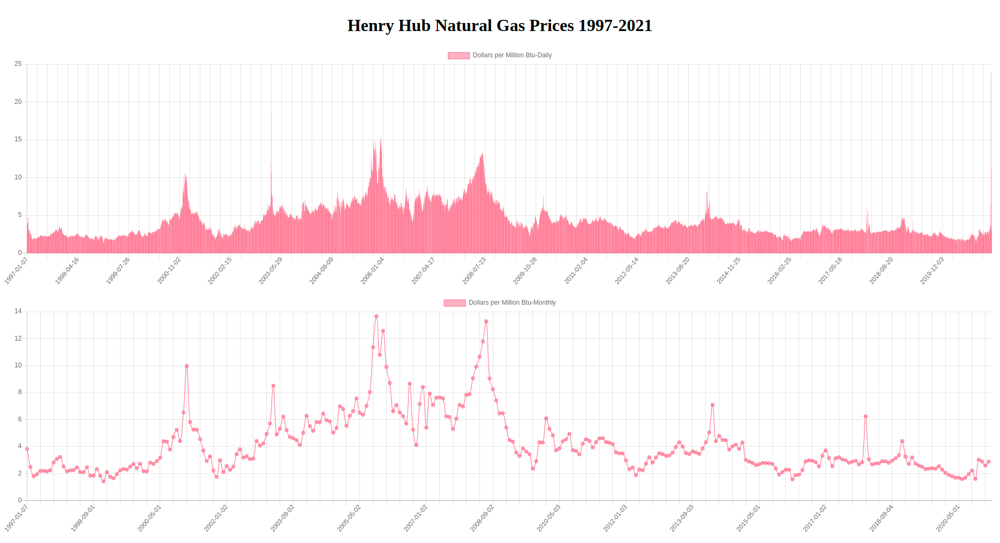

# Datopian-Challenge

This mini project is created as assignment for joining [Datopian SRE (DevOps) role](https://www.linkedin.com/jobs/view/2409438619/?refId=cEP0uqU0R9L0fKb0hUMCVg%3D%3D) as Software Engineer.

Challenge:
https://gist.github.com/rufuspollock/f295e6d2fd6fecb705ff

The charts bellow show Henry Hub Natural Gas Prices between 1997-2021.

Created using ChartJs library from https://www.chartjs.org/

I've enjoyed this challenge, it helps me to do some recaps on python and javascript , Thanks Datopian.
